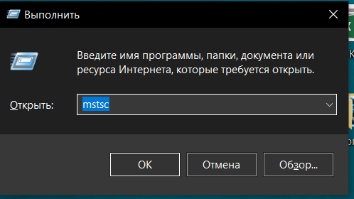
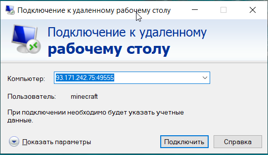
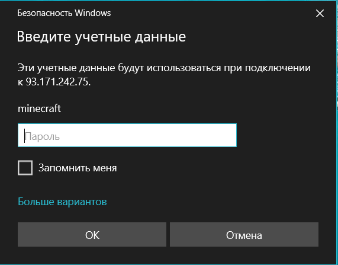
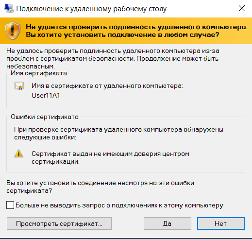

### Підключення До Віддаленого Робочого Столу
#### 1. Натиснути комбінацію клавіш Win + R
___
#### 2. В з’явившися вікно написати команду mstsc і натиснути ОК
 
___
#### 3. Далі написати IP адрес ПК до якого плануєте підключитися і натиснути на підключитися
 
___
#### 4.В наступному вікні вводимо логін і пароль від ПК до якого плануємо підключитися і натискаємо ОК
 
___
#### 5. В наступному вікні теж натискаємо ТАК 
 
___
#### 6. Все готово, можемо працювати 